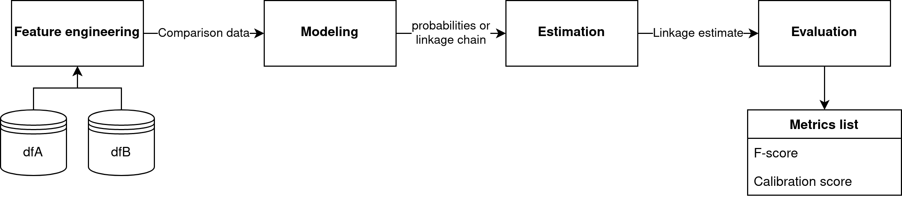

This document outlines a few things that I think we should code up to make simulation studies easier to manage and scale up.

I recommend coding and experimenting in Rmd documents or using anything that you're most comfortable with. Once we have functions that we're happy with, then we can go through the process of documenting them, putting them in a package, and testing them. 

## Architecture outline

The diagram below shows the architecture of entity resolution systems such as those implemented in the BRL and fastLink packages.

There are two main types of components: functions (or modules) and data structures.



### Data structures

1. **Input data dfA and dfB:** R dataframes with string, categorical (factor), or numerical values.
2. **Comparison data:** Dataframe containing observed comparison vector values as rows together with the counts of observed values. Example:

```{r, eval=FALSE}
           gamma.1 gamma.2 gamma.3 gamma.4 counts
     [1,]       0       0       0       0 113956
     [2,]       1       0       0       0    187
     [3,]       2       0       0       0   1455
     [4,]       0       1       0       0     24
     [5,]       0       2       0       0    802
     ...
     [22,]       1      NA       0       2      1
     [23,]       2      NA       0       2      5
     [24,]       0       0       2       2      1
     [25,]       2       2       2       2     43
     [26,]       2      NA       2       2      7
```

3. **probabilities or linkage chain:**
    a. **Linkage probabilities** should be represented as a sparse matrix (exact format to be determined).
    b. **Posterior distribution** on the linkage should be represented as matrix with each row corresponding to a sampled $Z$ vector.
4. **Linkage estimate:** A linkage estimate should be represented as a $Z$ vector.
5. **Evaluation metrics:** Evaluation metrics should be reported in a named list.

### Modules

1. **Feature engineering:** Both BRL and fastLink compute comparison data based on binary comparisons, string similarity comparison, etc.
2. **Modeling:** BRL does Bayesian modeling under the bipartite constraing, fastLink computes posterior marginal match probabilities.
3. **Estimation:** We have the following estimators:
    a. **F-score** optimized estimate for both probabilities and linkage chains.
    b. **Mauricio's Bayes estimator** for linkage chains.
    c. **MAP estimator (Jaro style) for both probabilities and linkage chains.
4. **Evaluation:** Requires ground truth data. We need to define the F-score and a calibration score. Anything else?

## Step 1: Define feature engineering functions

We can extract from fastLink and BRL functions which compute comparison data for given dataframes. Note that we need our feature engineering to return comparison data in the standardized form mentioned above.

### fastLink's feature engineering

I extracted from fastLink the following feature engineering function: `getComparisonData.fastLink()`.

```{r}
library(fastLink)
data(samplematch)

getComparisonData.fastLink <- function(dfA, dfB, varnames,
                               stringdist.match = NULL, 
                               stringdist.method = "jw",
                               numeric.match = NULL, 
                               partial.match = NULL,
                               cut.a = 0.94, cut.p = 0.88,
                               jw.weight = .10,
                               cut.a.num = 1, cut.p.num = 2.5,
                               n.cores = NULL){
  
    ## Create boolean indicators
    sm.bool <- which(varnames %in% stringdist.match)
    stringdist.match <- rep(FALSE, length(varnames))
    if(length(sm.bool) > 0){
        stringdist.match[sm.bool] <- TRUE
    }
    nm.bool <- which(varnames %in% numeric.match)
    numeric.match <- rep(FALSE, length(varnames))
    if(length(nm.bool) > 0){
        numeric.match[nm.bool] <- TRUE
    }
    pm.bool <- which(varnames %in% partial.match)
    partial.match <- rep(FALSE, length(varnames))
    if(length(pm.bool) > 0){
        partial.match[pm.bool] <- TRUE
    }
    gammalist <- vector(mode = "list", length = length(varnames))
    for(i in 1:length(gammalist)){
        if(is.factor(dfA[,varnames[i]]) | is.factor(dfB[,varnames[i]])){
            dfA[,varnames[i]] <- as.character(dfA[,varnames[i]])
            dfB[,varnames[i]] <- as.character(dfB[,varnames[i]])
        }
        if(stringdist.match[i]){
            if(partial.match[i]){
                gammalist[[i]] <- gammaCKpar(
                    dfA[,varnames[i]], dfB[,varnames[i]], cut.a = cut.a, cut.p = cut.p, method = stringdist.method, w = jw.weight, n.cores = n.cores
                )
            }else{
                gammalist[[i]] <- gammaCK2par(dfA[,varnames[i]], dfB[,varnames[i]], cut.a = cut.a, method = stringdist.method, w = jw.weight, n.cores = n.cores)
            }
        }else if(numeric.match[i]){
            if(partial.match[i]){
                gammalist[[i]] <- gammaNUMCKpar(
                    dfA[,varnames[i]], dfB[,varnames[i]], cut.a = cut.a.num, cut.p = cut.p.num, n.cores = n.cores
                )
            }else{
                gammalist[[i]] <- gammaNUMCK2par(
                    dfA[,varnames[i]], dfB[,varnames[i]], cut.a = cut.a.num, n.cores = n.cores
                )
            }
        }else{
            gammalist[[i]] <- gammaKpar(dfA[,varnames[i]], dfB[,varnames[i]], n.cores = n.cores)
        }
    }
    nr_a <- nrow(dfA)
    nr_b <- nrow(dfB)
    counts <- tableCounts(gammalist, nobs.a = nr_a, nobs.b = nr_b, n.cores = n.cores)
    return(counts)
}

comparisonData = getComparisonData.fastLink(
  dfA = dfA, dfB = dfB, 
  varnames = c("firstname", "middlename", "lastname", "housenum", "streetname", "city", "birthyear"),
  stringdist.match = c("firstname", "middlename", "lastname", "streetname", "city"),
  partial.match = c("firstname", "lastname", "streetname")
)

head(comparisonData)
```

### BRL's feature engineering

```{r}
library(dplyr)
library(BRL)
data(twoFiles)

# This needs to be checked
getComparisonData.BRL <- function(df1, df2, flds, types) {
  cd <- compareRecords(df1, df2, flds, types)
  nDisagLevs = cd$nDisagLevs
  comparisons = cd$comparisons
  
  table = t(t(comparisons) * as.vector(sapply(1:length(nDisagLevs), function(i) (1:nDisagLevs[i]) - 1)))
  
  cs = c(0, cumsum(nDisagLevs))

  columns = sapply(1:length(nDisagLevs), function(i) {
    return(rowSums(table[, (cs[i]+1):cs[i+1]]))
  })
  counts = data.frame(columns) %>% group_by_all() %>% count(name="count")
  
  colnames(counts) = c(paste0("gamma.", 1:length(nDisagLevs)), "count")
  
  return(counts %>% ungroup())
}

getComparisonData.BRL(df1, df2, flds=c("gname", "fname", "age", "occup"), types=c("lv","lv","bi","bi"))
```


## Step 2: Modeling

### Fitting BRL based on comparison data

TODO

### Fitting fastLink based on comparison data

TODO

## Step 3: Estimation

TODO

## Step 4: Evaluation

TODO


